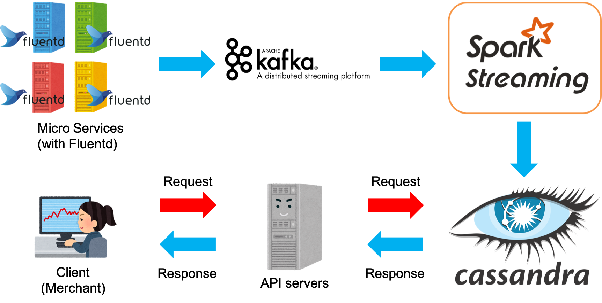

# Google Analytic like Backend System
## System requirements
- handle large write volume: Billions write events per day.
- handle large read/query volume: Millions merchants want to get insight about their business. Read/Query patterns are time-series related metrics.
- provide metrics to customers with at most one hour delay.
- run with minimum downtime.
- have the ability to reprocess historical data in case of bugs in the processing logic.

  
## System requirements analysis
- write volume: 10 billions events per day lead to 120K events per second.
- read volume: 100 millions query data per day lead to 1.2K query per second.
- update analytical results real-time normally, at most one hour delay.
- 99.99% uptime.
- store historical data for 1 year for future use.

  
## Design
According to the requirements and its analysis described above, I suggest the following design.
  
  

  
  

### Micro services (with Fluentd)
For log collecting and sending it to Kafka servers.

Each service receives many kinds of logs such as app logs, access logs and system logs from production servers.
Use Fluentd to unify these logs and send it to Kafka servers.

It must keep these logs in each local storage unless sending logs succeed.

[Fluentd](https://www.fluentd.org/) is an open source data collector for unified logging layer.

  
### Kafka
For persistent store and streaming pipe. Kafka can stream data continuously from a source. Aggregating all logs on Kafka and send it to Spark Streaming.

It must store data for 1 year in case of bugs in the processing logic.

[Kafka](https://kafka.apache.org/) is an open source software which provides a framework for storing, reading and analysing streaming data. It is a popular distributed pub-sub messaging platform that offers persistent store and high scalability. 

  
### Spark Streaming
For micro batch process for the stream data from Kafka. It Processes this stream of data instantly with its in-memory processing primitive, and update the Casandra table after the process.

[Spark Streaming](https://spark.apache.org/streaming/) brings Apache Spark's language-integrated API to stream processing, letting you write streaming jobs the same way you write batch jobs. It supports Java, Scala and Python.

  
### Casandra
For storing the result of the micro batch process.

[Casandra](http://cassandra.apache.org/) is an extremely powerful open source distributed database system that works extremely well to handle huge volumes of records. 

  
### API servers
For querying data from Casandra, formatting and providing it to client side.

  
### Other aspects
In case of bugs in the processing logic, get past data from micro services or Kafka and reprocess the logic.
